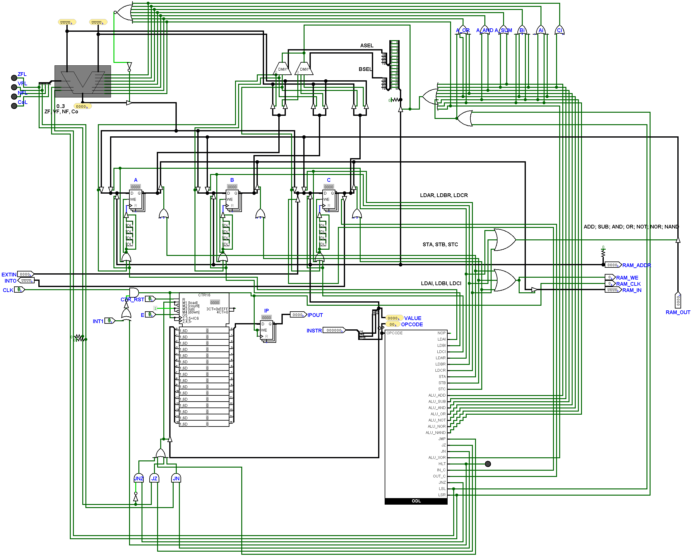
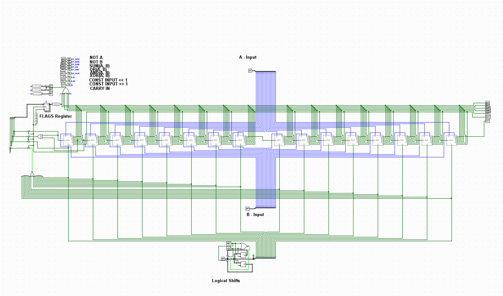
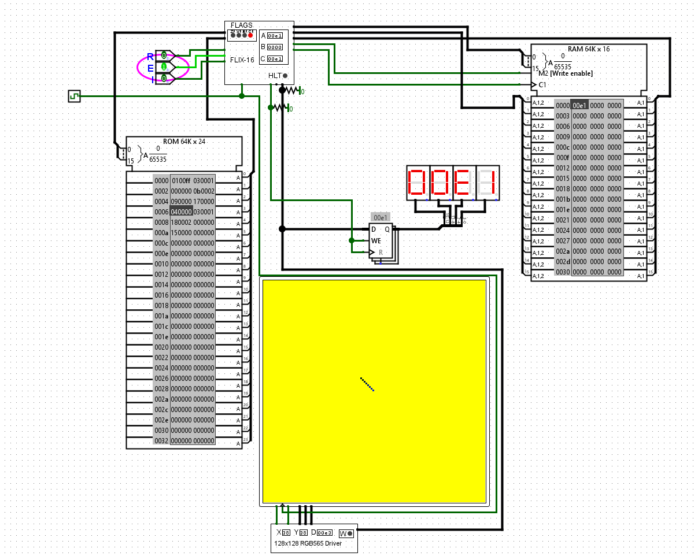

 

# Flix-16

*My small 16-bit processor.*

 
 

[![Button Logism]][Logism]   
[![Button Emulator]][Emulator]   
[![Button Instruction Set]][Instruction Set]

 
 

## Features

 

<kbd>    **Emulator Implementation**    </kbd>   
<kbd>    **Logism-Evolution Files**    </kbd>   
<kbd>   **27 Instructions**    *Some are variations of others.*   </kbd>

 
 

## ⚠  Beware  ⚠

 

Trust me, once you get to the implementation of  
the ALU instructions, you will regret looking at this.

 

I was tired and lazy, which isn't really an excuse but eh.

***Have fun.***

 
 

## Showcase

*Diagrams of the **Logism** wiring.*

 

### Chip Design

 

 

### CPU Internals

 

 

### 16-Bit ALU

*This Arithmetic Logic Unit is implemented using*  
*a carry-cascade style array of  `1 Bit`  ALU's.*

 

 

### Test Setup

*The program in the ROM chip to the left is a simple countdown from  
`0xff - 0x00`  which is being displayed on aforementioned display.*

 

 

<!----------------------------------------------------------------------------->

[Instruction Set]: Documentation/Instruction%20Set.md
[Emulator]: Source/Emulator
[Logism]: Source/Logism

<!---------------------------------[ Buttons ]--------------------------------->

[Button Instruction Set]: https://img.shields.io/badge/Instruction_Set-006272?style=for-the-badge&logoColor=white&logo=Buffer
[Button Emulator]: https://img.shields.io/badge/Emulator-00897B?style=for-the-badge&logoColor=white&logo=GNUBash
[Button Logism]: https://img.shields.io/badge/Logism-A22430?style=for-the-badge&logoColor=white&logo=Node-RED